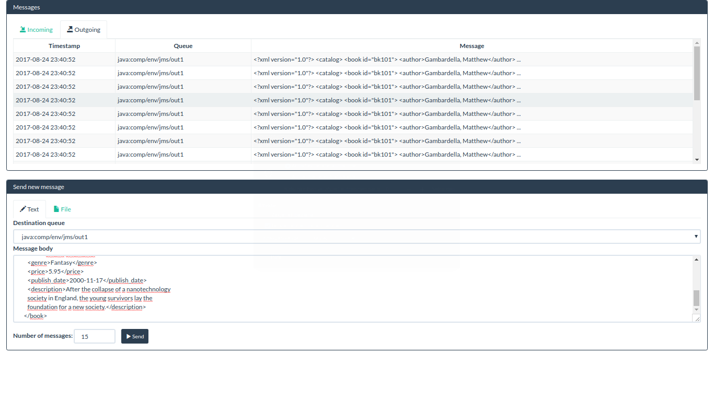

## JmsTool   
This is a simple web app (Angular frontend and Spring backend) to receive and send JMS messages in a J2EE container (Apache Tomcat, IBM WebSphere, ...)

### Features:
* Multiple JMS queues for sending and receiving of JMS messages
* List view of all outgoing and incoming messages
* Pop up notifications on new received messages
* Detail view of a single message (Text, message properties)
* Sending of JMS message
* Single message as text
* Receive and view BytesMessages with encoded text
* Upload of ZIP with message files - each message inside will be sent
* Asyncronous sending of messages with progress indication
* Stop and start JMS Queue listeners

### Configuration
Please change following configuration properties (application.properties in WAR, environment variables or as JNDI context properties) before deployment.

| Property             | Description                               | Mandatory | Example  |
| -------------------- |:-----------------------------------:      |:--------:|:---------:|
| spring.jms.jndi-name | JNDI name of JMS connection factory       | yes      | java:comp/env/jms/cf |
| jmstool.incomingQueues | comma separated list of incoming queues | no       | java:comp/env/jms/in1, java:comp/env/jms/in2|
| jmstool.outgoingQueues | comma separated list of outgoing queues | no | java:comp/env/jms/out1, java:comp/env/jms/out2|
| jmstool.userMessageProperties | message properties for outgoing messages | no | MYPROP1,MYPROP2 |
| jmstool.showMessagePropertiesForIncomingMessages | show these message property keys in message window for incoming messages | no | MYPROP |
| jmstool.encoding | Default encoding used for BytesMessages (default: UTF-8) | no | ISO-8859-15 |

### Development
See this page [Hints for development](DEV.md)
